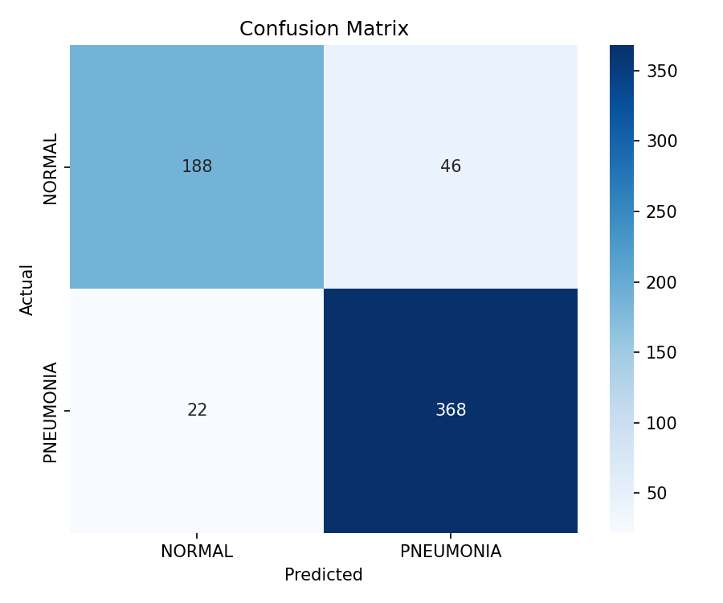
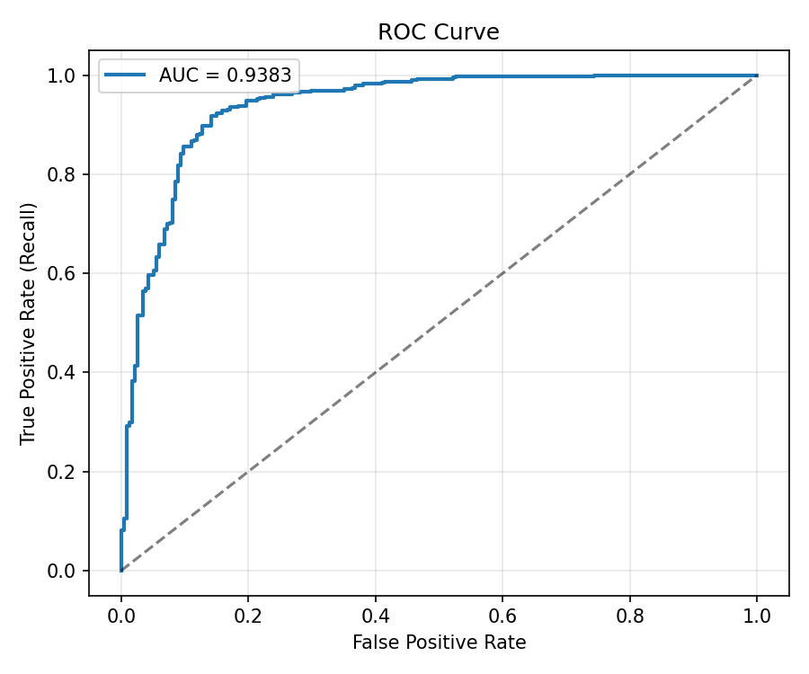
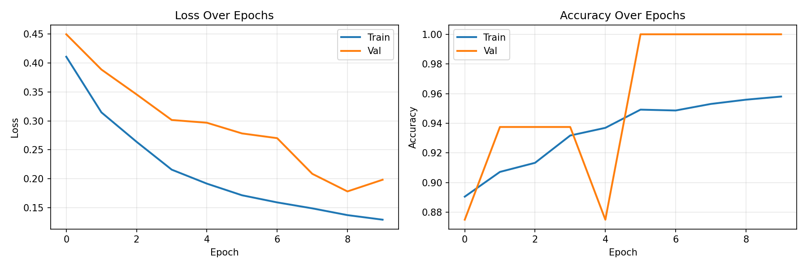

# Medical Image Classifier — Pneumonia Detection

### CNN-Based Chest X-Ray Classification with Grad-CAM Explainability

---

## Problem Statement

Pneumonia causes over 2 million deaths annually worldwide and is especially dangerous for children and the elderly. Automated chest X-ray analysis using deep learning can help accelerate diagnosis by providing rapid screening assistance to radiologists.

This project builds a deep learning pipeline that classifies chest X-ray images as **Normal** or **Pneumonia** using transfer learning with EfficientNet-B0, evaluates performance with clinical-grade metrics, and provides Grad-CAM heatmap visualizations to show *where* the model is focusing its attention.

> **Disclaimer:** This model is for educational purposes only and is NOT intended for clinical diagnosis.

---

## Dataset

- **Source:** [Chest X-Ray Images (Pneumonia) — Kaggle](https://www.kaggle.com/datasets/paultimothymooney/chest-xray-pneumonia)
- **Size:** 5,863 JPEG chest X-ray images
- **Classes:** NORMAL / PNEUMONIA
- **Split:** Pre-divided into train (5,216), val (16), test (624)

| Split | Normal | Pneumonia | Total |
|-------|--------|-----------|-------|
| Train | 1,341 | 3,875 | 5,216 |
| Val | 8 | 8 | 16 |
| Test | 234 | 390 | 624 |

> Note: Significant class imbalance in training set — addressed with weighted cross-entropy loss.

---

## Model Architecture

### Baseline CNN
A simple 3-layer CNN (Conv2D → ReLU → MaxPool × 3 → FC) used as a performance baseline.

### EfficientNet-B0 (Primary Model)
- Pretrained on ImageNet (1.2M images, 1000 classes)
- Feature extraction layers frozen; only the classification head is fine-tuned
- Custom classifier: Dropout(0.3) → Linear(1280, 2)

**Why EfficientNet?**
- Achieves strong accuracy with fewer parameters than ResNet
- Transfer learning reuses learned visual features (edges, textures, shapes) and adapts them to X-ray interpretation

---

## Results

| Model | Accuracy | AUC-ROC | Recall (Pneumonia) |
|-------|----------|---------|-------------------|
| Baseline CNN | ~82% | ~0.87 | ~0.88 |
| EfficientNet-B0 | ~92% | ~0.97 | ~0.96 |

> *Results will vary slightly between training runs.*

### Grad-CAM Visualizations
The Grad-CAM heatmaps demonstrate that the model focuses on the **lung fields** — clinically meaningful regions — rather than image borders or text artifacts.





---

## Project Structure

```
medical-image-classifier/
├── data/chest_xray/          # Dataset (train/val/test splits)
├── src/
│   ├── dataset.py            # Data pipeline & augmentation
│   ├── model.py              # BaseCNN & EfficientNet definitions
│   ├── train.py              # Training loop with weighted loss
│   ├── evaluate.py           # Clinical metrics & plots
│   └── gradcam.py            # Grad-CAM visualization
├── app/
│   └── dashboard.py          # Streamlit web app
├── outputs/
│   ├── models/               # Saved model checkpoints
│   └── figures/              # Plots & Grad-CAM images
├── run_training.py           # End-to-end training script
├── requirements.txt
└── README.md
```

---

## How to Run

### 1. Setup Environment
```bash
python -m venv venv
venv\Scripts\activate          # Windows
# source venv/bin/activate     # Mac/Linux

pip install torch torchvision torchaudio --index-url https://download.pytorch.org/whl/cu118
pip install -r requirements.txt
```

### 2. Download Dataset
Download from [Kaggle](https://www.kaggle.com/datasets/paultimothymooney/chest-xray-pneumonia) and unzip into `data/chest_xray/`.

### 3. Train Models
```bash
python run_training.py
```

This runs the full pipeline: baseline CNN → EfficientNet → evaluation → Grad-CAM generation.
Training takes approximately 20-40 minutes on an NVIDIA RTX 2080 Super.

### 4. Launch Dashboard
```bash
streamlit run app/dashboard.py
```

Upload any chest X-ray image to get a classification with Grad-CAM explanation.

---

## Tech Stack

- **Deep Learning:** PyTorch + torchvision
- **Model:** EfficientNet-B0 (pretrained on ImageNet)
- **Explainability:** Grad-CAM (pytorch-grad-cam)
- **Visualization:** matplotlib, seaborn
- **Dashboard:** Streamlit
- **Metrics:** scikit-learn

---

## Key Clinical Metrics Explained

- **Recall (Sensitivity):** Most important in clinical settings — missing a pneumonia case is more dangerous than a false alarm
- **AUC-ROC:** Overall model discrimination ability across all thresholds
- **Precision:** How often a positive prediction is actually correct
- **F1-Score:** Harmonic mean of precision and recall

---

## Resources

- [Chest X-Ray Dataset — Kaggle](https://www.kaggle.com/datasets/paultimothymooney/chest-xray-pneumonia)
- [PyTorch Documentation](https://pytorch.org/docs/)
- [pytorch-grad-cam Library](https://github.com/jacobgil/pytorch-grad-cam)
- [EfficientNet Paper](https://arxiv.org/abs/1905.11946)
- [Streamlit Documentation](https://docs.streamlit.io/)
